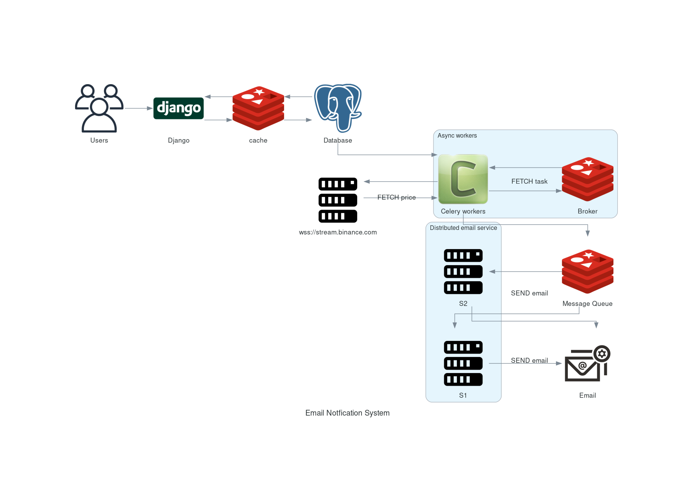

# TanXFi 
An microservice application to solve the problem mentioned in the [problem.md](problem.md).
Basically a price monitoring system which mails when a certain threshold is met.

- The [API Documentation](https://github.com/Sarath191181208/tanXfi/wiki/API-Documentation)
- The [Alert system design doc](https://github.com/Sarath191181208/tanXfi/wiki/Email-System-Documentation)

## Architecture 
- This diagram is created using [https://diagrams.mingrammer.com](https://diagrams.mingrammer.com)


## Overview 
The project uses the fowlling technologies: 
- Django / DjangoREST 
- Celery 
- redis
- Docker 
- Docker compose 
- JWT 
- Websockets

## Folder structure 
```
.
├── alerts/                     # A Django subapp performing CRUD ops on DB
├── assets/                     # Stores the architecture diagrams
├── email_service/              # Incharge of sending emails
├─ users/ ([Test]               # User management stuff for easier testing !! NOT SAFE !!
├── price_alert/                # Project root folder
├── .postgres-data              # PostgreSQL data directory
├── .gitignore                  # Git ignore file
├── .redis                      # Redis data directory
├── .tmux                       # tmux session file
├── Pipfile                     # Pipenv dependency file
├── Pipfile.lock                # Pipenv lock file
├── manage.py                   # Django project management script
├── problem.md                  # Document describing problem given by tanX
├── README.md                   # Project README file
├── References.md               # References and resources
├── test.txt                    # Test file
├── docker-compose.yml          # Docker Compose configuration
├── Dockerfile                  # Dockerfile for building images
└── Todo.md                     # TODO list or notes
```

### Features 
- Create, Read, Delete alerts for the pricing alerts.
- Realtime price monitoring using wss://stream.binance.com.
- Highly scalable email notification system using redis as a queue.
    
### End points 
[The Full API Documentation](https://github.com/Sarath191181208/tanXfi/wiki/API-Documentation)

- `POST /api/token` Creates and responds with a JWT and a refresh token.
- `POST /api/token/refresh/` Refresh the current JWT token.
- `POST /alerts/create/` Creates a new alert 
- `DELETE /alerts/delete` Deletes an alert 
- `GET /alerts` Gets the alert and supports query params

## Requirements 
- docker installed `sudo pacman -Sy docker`
- docker-compose installed `sudo pacman -Sy docker-compse`

## Setting up the project locally 

1. Clone the repository
    ```bash
    git clone https://github.com/Sarath191181208/tanXfi
    ```
2. Go into the cloned repository
    ```bash
    cd tanXfi
    ```
3. Run the docker compose
    ```bash
    docker-compose up 
    ```

## Setting up dev environment 
**(THIS IS JUST MY PREFERENCE)**

If you use neovim you can easily set up a dev environment using `.tmux` file it's just a sh script.
These are the steps you have to follow:

1. Make the `.tmux` file executable
    ```bash
    chmod +x ./.tmux
    ```
2. Run the `.tmux` file to setup the neovim and tmux env.

    ```bash
    ./.tmux
    ```
3. What it does is it creates 4 windows namely `1.nvim`, `2.cmd`, `3.docker`, `4.lazydocker` and puts you in this tmux session. This helps you by saving configuring tmux manually.

## Unsafe practices 
All the unsafe practices like putting visible `passwords`, `keys`, `apis`, etc... Are to make the review purpose easier.

## Todo 
The work that needs to be done is put in [Todo.md](Todo.md).

## Future work, Drawbacks with possible solutions
- Read is high and writes are low. 
    - A. Use cache (already using redis)
    - B. Use a read replica.
- The system highly relies on the celery worker, it's a single point of failure. 
    - A. Use multiple celery workers using `celery multi start 2 -A my_proj -c=1 -B:2 -Q:2 notification`
- The fetching of emails from db isn't done in a distributed manner hurting performance.
    - A. Shard the db and have workers pickup a shard and work on it. This will require the fowlling things:
        - db should have `read replica` to not make original db suffer with many connections. 
        - alert service should follow `master-slave` to make sure the work isn't getting dropped
        - `message broker` to save the work of alert service into.
        - `master-slave email sending consumers` master-slave is to make sure the work isn't getting dropped by consuer to send emails.
- `wss://stream.binance.com` disconnects after 24hrs.
    - A. Try an exponential backoff policy to reconnect after 24hrs. 
- On `send_mail` failure the whole system bounces back the email back and forth keeping the shole system at bay.
    - A. Try to create a count int the object to only try until some time. 

